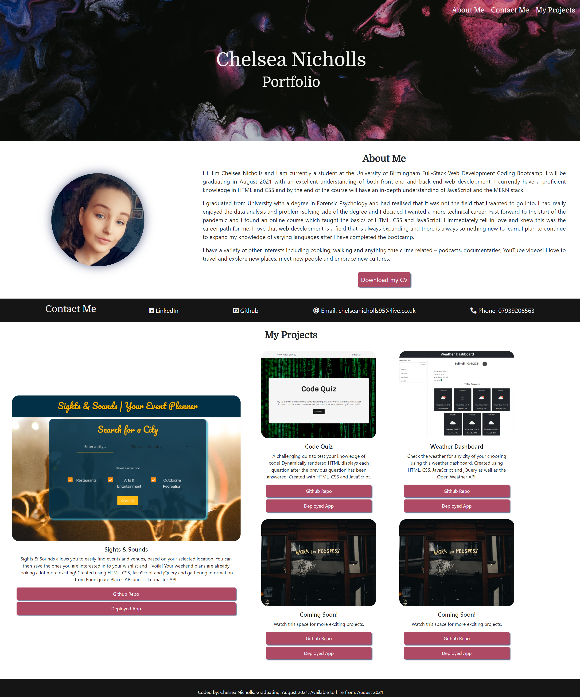
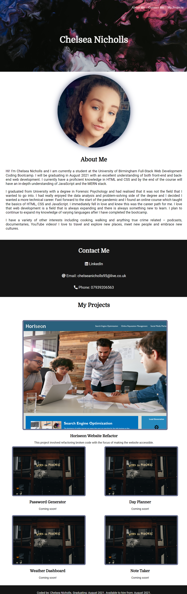
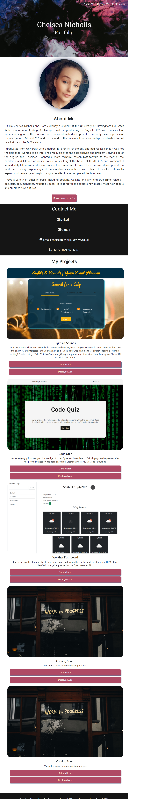

# Personal Portfolio 

## Description

The aim of this project was to create a responsive personal portfolio with HTML and CSS using core skills such as flex boxes, media queries and CSS variables.

## Table of Contents

[Description](#description)  
[Technologies Used](#technologies-used)  
[Link to Deployed Application](#link-to-deployed-application)  
[Getting Started](#getting-started)  
[Screenshots](#screenshots)

### Features

- Fully responsive for all screen sizes.
- Animation on main header.
- Colour changes when hovering over links.
- All images have titles and alt tags - accessibility friendly.
- All images are clickable and linked to the relevant pages.
- One project image is larger than the rest - highlights best project to date.
- Opacity and border changes when hovering over a project image.

## Technologies Used

- HTML5
- CSS
- Bootstrap

## Link to Deployed Application

Click [here](https://chelseanicholls95.github.io/personal_portfolio/) to view project.

## Getting Started

```
git clone git@github.com:chelseanicholls95/personal_portfolio.git
cd personal_portfolio
code .
```

## Screenshots

### Desktop



### Tablet



### Mobile



## License

This project is licensed under the MIT license.

## Questions

- Visit my [GitHub](https://github.com/chelseanicholls95)
- Email me at chelseanicholls1995@outlook.com
